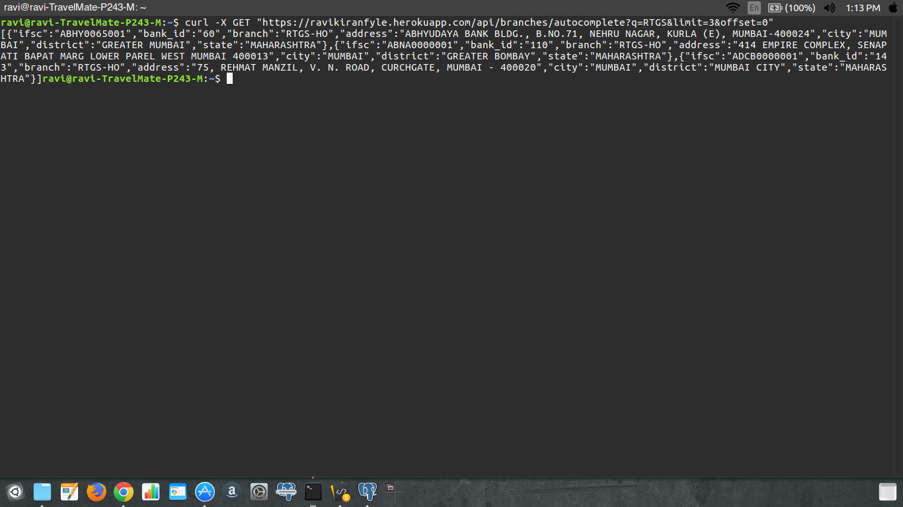

# Fyle
##Creating  a REST service that can fetch bank details, using the data given in the API’s query parameters. 
Hosting URL :- https://ravikiranfyle.herokuapp.com/. 
GitHub Link :- https://github.com/pilliravikiran/ravikiranfyle. 
END-POINT -1  
Curl Script :- curl -X GET "https://ravikiranfyle.herokuapp.com/api/branches/autocomplete?q=RTGS&limit=3&offset=0"  

END-POINT -2  
Curl Script :- curl -X GET "https://ravikiranfyle.herokuapp.com/api/branches?q=BANGALORE&limit=4&offset=0"  

INSTALLATION PROCESS :- 
1) Install PostgreSql  
      sudo apt-get install postgresql postgresql-contrib 
2) Login in to PostgreSql  
      sudo -u postgres psql 
3)Create your DataBase 
      createdb db_name 
4) Dump the data indian_banks.sql to your database 
     psql db_name < indian_banks.sql 

Go to the repository and open terminal 
5) npm install 
6) npm start 
Make sure to change .env file according to your database 
DB_USER=your_user_name 
  DB_PASSWORD=your_password 
  DB_HOST=localhost 
  DB_PORT=5432 
  DB_DATABASE=your_database_name 
  
7) END POINT -1  
    Autocomplete API to return possible matches based on the branch name ordered by IFSC code (ascending order) with limit and offset. 
        http://localhost:8000/api/branches/autocomplete?q=RTGS&limit=3&offset=0 
8) END POINT -2 
  Search API to return possible matches across all columns and all rows , ordered by IFSC code (ascending order) with limit and offset. Commit 
            http://localhost:8000/api/branches/?q=BANGALORE&limit=4&offset=0 

    

